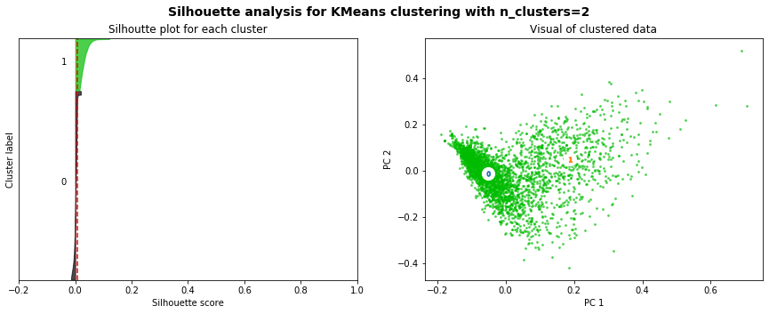

## Supplemental Code: Preprocessing, Bi-grams, and Cluster Analysis

The following code and data includes text preprocessing done on the collected Reddit comments from r/asianamerican and an initial bi-grams and cluster analysis.

The code is written in ``Python 3.7.6`` and all of its dependencies can be installed by ruhnning the following in the terminal (with the ``requirements.txt`` file included in the repo):

``pip install -r requirements.txt``

### Preprocessing

To preprocess the comments text data, you can import the ``preprocess`` module located in this repo to reproduce the preprocessing in the (hypothetical) publication that this code supplements (in a Jupyter Notebook, like readme.ipynb in this repo, or in any other Python script):


```python
import preprocess
```

    c:\Users\danie\anaconda3\lib\site-packages\torch\cuda\__init__.py:52: UserWarning: CUDA initialization: Found no NVIDIA driver on your system. Please check that you have an NVIDIA GPU and installed a driver from http://www.nvidia.com/Download/index.aspx (Triggered internally at  ..\c10\cuda\CUDAFunctions.cpp:100.)
      return torch._C._cuda_getDeviceCount() > 0
    

You can then use the ``preprocess_data`` function in the ``preprocess`` module to preprocess the comments data and get it ready for analysis. The below code takes approx 14 mins to run.


```python
df = preprocess.preprocess_data(input='data/top_100_post_comments_user_flair.txt', output='data/comments_df_readme.csv')
```

### Bi-grams

To run the initial analyses, import the ``cluster_analysis`` module.


```python
import cluster_analysis
```

Use the ``bigrams_freq `` function to get the top-n bigrams of the comments data.


```python
df.head(5)
```


<div>
<style scoped>
    .dataframe tbody tr th:only-of-type {
        vertical-align: middle;
    }

    .dataframe tbody tr th {
        vertical-align: top;
    }

    .dataframe thead th {
        text-align: right;
    }
</style>
<table border="1" class="dataframe">
  <thead>
    <tr style="text-align: right;">
      <th></th>
      <th>username</th>
      <th>flair_text</th>
      <th>body</th>
      <th>tokens</th>
      <th>normalized_tokens</th>
      <th>word_count</th>
      <th>normalized_tokens_count</th>
    </tr>
  </thead>
  <tbody>
    <tr>
      <th>0</th>
      <td>Tungsten_</td>
      <td>NaN</td>
      <td>Thanks to everyone who engaged in insightful a...</td>
      <td>[Thanks, to, everyone, who, engaged, in, insig...</td>
      <td>[thank, engage, insightful, respectful, discou...</td>
      <td>20</td>
      <td>9</td>
    </tr>
    <tr>
      <th>1</th>
      <td>ProudBlackMatt</td>
      <td>Chinese-American</td>
      <td>I would prefer using a process that takes into...</td>
      <td>[I, would, prefer, using, a, process, that, ta...</td>
      <td>[prefer, process, take, account, poverty, inst...</td>
      <td>103</td>
      <td>52</td>
    </tr>
    <tr>
      <th>2</th>
      <td>TomatoCanned</td>
      <td>NaN</td>
      <td>u/Tungsten_, Thanks for creating a section jus...</td>
      <td>[u/Tungsten_,, Thanks, for, creating, a, secti...</td>
      <td>[u/tungsten_,, thank, create, section, discuss...</td>
      <td>269</td>
      <td>126</td>
    </tr>
    <tr>
      <th>3</th>
      <td>bad-fengshui</td>
      <td>NaN</td>
      <td>As with anything related to Asians in politics...</td>
      <td>[As, with, anything, related, to, Asians, in, ...</td>
      <td>[relate, asians, politic, m, see, lot, non, as...</td>
      <td>59</td>
      <td>25</td>
    </tr>
    <tr>
      <th>4</th>
      <td>Pancake_muncher</td>
      <td>NaN</td>
      <td>Yet colleges will allow alumni and doners in e...</td>
      <td>[Yet, colleges, will, allow, alumni, and, done...</td>
      <td>[college, allow, alumnus, doner, easily, consi...</td>
      <td>40</td>
      <td>19</td>
    </tr>
  </tbody>
</table>
</div>


```python
n=25
top_25_bigrams = cluster_analysis.bigrams_freq(df=df, text_col='normalized_tokens',n=n)
top_25_bigrams
```


    [(('affirmative', 'action'), 1455.0),
     (('asian', 'americans'), 564.0),
     (('asian', 'american'), 337.0),
     (('white', 'people'), 206.0),
     (('high', 'school'), 160.0),
     (('college', 'admission'), 142.0),
     (('race', 'base'), 112.0),
     (('asian', 'student'), 110.0),
     (('legacy', 'admission'), 108.0),
     (('test', 'score'), 90.0),
     (('ivy', 'league'), 89.0),
     (('white', 'student'), 86.0),
     (('high', 'education'), 85.0),
     (('black', 'hispanic'), 83.0),
     (('support', 'affirmative'), 83.0),
     (('black', 'people'), 79.0),
     (('student', 'body'), 79.0),
     (('asian', 'applicant'), 78.0),
     (('model', 'minority'), 77.0),
     (('black', 'latino'), 74.0),
     (('chinese', 'americans'), 71.0),
     (('middle', 'class'), 71.0),
     (('supreme', 'court'), 71.0),
     (('black', 'student'), 68.0),
     (('asian', 'kid'), 67.0)]


The top bi-grams are what we might expect: 'affirmative action', 'asian americans', 'college admission', etc. It may be noteworthy that while 'support affirmative' is a top bi-gram, there is no bi-gram that expresses being against affirmative action.

### Cluster Analysis


```python
numClustersList = [2, 3, 4, 5, 10, 20]
col1 = 'normalized_tokens'
col2 = 'normalized_tokens_str'
n_words = 10

for n_cluster in numClustersList:
    cluster_analysis.plotSilhouette(df, col1, col2, n_cluster, n_words)
```

    'c' argument looks like a single numeric RGB or RGBA sequence, which should be avoided as value-mapping will have precedence in case its length matches with 'x' & 'y'.  Please use a 2-D array with a single row if you really want to specify the same RGB or RGBA value for all points.
    





    For n_clusters = 2, The average silhouette_score is : 0.007789599172877796
    Most-distinguishing terms per cluster:
    Cluster 0:
    asian
    people
    white
    aa
    asians
    think
    like
    school
    student
    race
    
    
    Cluster 1:
    action
    affirmative
    asian
    white
    people
    admission
    americans
    race
    asians
    college
    
    
    

    'c' argument looks like a single numeric RGB or RGBA sequence, which should be avoided as value-mapping will have precedence in case its length matches with 'x' & 'y'.  Please use a 2-D array with a single row if you really want to specify the same RGB or RGBA value for all points.
    


    For n_clusters = 3, The average silhouette_score is : 0.009472908533114235
    Most-distinguishing terms per cluster:
    Cluster 0:
    people
    like
    think
    school
    race
    aa
    good
    chinese
    way
    point
    
    
    Cluster 1:
    asian
    white
    asians
    people
    student
    americans
    black
    aa
    harvard
    american
    
    
    Cluster 2:
    action
    affirmative
    asian
    admission
    race
    americans
    people
    support
    college
    minority
    
    
    

    'c' argument looks like a single numeric RGB or RGBA sequence, which should be avoided as value-mapping will have precedence in case its length matches with 'x' & 'y'.  Please use a 2-D array with a single row if you really want to specify the same RGB or RGBA value for all points.
    


    For n_clusters = 4, The average silhouette_score is : 0.010552463928595596
    Most-distinguishing terms per cluster:
    Cluster 0:
    action
    affirmative
    asian
    americans
    race
    support
    people
    college
    admission
    minority
    
    
    Cluster 1:
    like
    think
    race
    people
    chinese
    comment
    know
    way
    good
    point
    
    
    Cluster 2:
    student
    school
    admission
    legacy
    harvard
    asian
    high
    applicant
    score
    class
    
    
    Cluster 3:
    asian
    white
    people
    asians
    americans
    aa
    minority
    think
    american
    black
    
    
    

    'c' argument looks like a single numeric RGB or RGBA sequence, which should be avoided as value-mapping will have precedence in case its length matches with 'x' & 'y'.  Please use a 2-D array with a single row if you really want to specify the same RGB or RGBA value for all points.
    


    For n_clusters = 5, The average silhouette_score is : 0.011888292354667304
    Most-distinguishing terms per cluster:
    Cluster 0:
    asian
    white
    people
    americans
    asians
    minority
    think
    aa
    like
    american
    
    
    Cluster 1:
    think
    like
    comment
    chinese
    way
    asians
    lol
    know
    say
    https
    
    
    Cluster 2:
    action
    affirmative
    asian
    americans
    race
    support
    college
    people
    minority
    white
    
    
    Cluster 3:
    legacy
    admission
    white
    harvard
    rid
    admit
    student
    affirmative
    action
    school
    
    
    Cluster 4:
    student
    school
    asian
    harvard
    race
    admission
    high
    class
    score
    aa
    
    
    

    'c' argument looks like a single numeric RGB or RGBA sequence, which should be avoided as value-mapping will have precedence in case its length matches with 'x' & 'y'.  Please use a 2-D array with a single row if you really want to specify the same RGB or RGBA value for all points.
    


    For n_clusters = 10, The average silhouette_score is : 0.015220596572741543
    Most-distinguishing terms per cluster:
    Cluster 0:
    race
    base
    aa
    class
    income
    admission
    affirmative
    action
    factor
    think
    
    
    Cluster 1:
    harvard
    asian
    personality
    student
    admission
    score
    asians
    applicant
    say
    school
    
    
    Cluster 2:
    white
    asians
    people
    asian
    minority
    aa
    black
    think
    like
    benefit
    
    
    Cluster 3:
    legacy
    admission
    rid
    admit
    white
    issue
    affirmative
    point
    action
    school
    
    
    Cluster 4:
    people
    good
    think
    like
    black
    aa
    way
    kid
    work
    mean
    
    
    Cluster 5:
    action
    affirmative
    asian
    support
    minority
    college
    people
    americans
    admission
    asians
    
    
    Cluster 6:
    https
    com
    www
    org
    asian
    en
    http
    wikipedia
    harvard
    wiki
    
    
    Cluster 7:
    school
    student
    high
    asian
    college
    university
    admission
    black
    kid
    ivy
    
    
    Cluster 8:
    asian
    americans
    american
    group
    chinese
    think
    aa
    minority
    like
    community
    
    
    Cluster 9:
    like
    comment
    thank
    lol
    think
    know
    chinese
    way
    aa
    right
    
    
    

    'c' argument looks like a single numeric RGB or RGBA sequence, which should be avoided as value-mapping will have precedence in case its length matches with 'x' & 'y'.  Please use a 2-D array with a single row if you really want to specify the same RGB or RGBA value for all points.
    


    For n_clusters = 20, The average silhouette_score is : 0.020458745197143673
    Most-distinguishing terms per cluster:
    Cluster 0:
    minority
    model
    white
    asian
    affirmative
    asians
    action
    group
    myth
    like
    
    
    Cluster 1:
    com
    https
    www
    harvard
    http
    action
    affirmative
    asian
    article
    html
    
    
    Cluster 2:
    legacy
    admission
    rid
    admit
    white
    point
    issue
    affirmative
    action
    student
    
    
    Cluster 3:
    american
    asian
    community
    like
    action
    think
    group
    people
    americans
    affirmative
    
    
    Cluster 4:
    americans
    asian
    affirmative
    action
    group
    aa
    support
    think
    benefit
    people
    
    
    Cluster 5:
    think
    like
    way
    asian
    right
    know
    good
    thing
    time
    want
    
    
    Cluster 6:
    education
    vote
    agree
    high
    college
    asian
    think
    race
    economic
    like
    
    
    Cluster 7:
    aa
    think
    white
    asian
    race
    support
    like
    say
    admission
    asians
    
    
    Cluster 8:
    school
    high
    student
    asian
    kid
    good
    college
    like
    ivy
    uc
    
    
    Cluster 9:
    action
    affirmative
    asian
    college
    admission
    support
    people
    asians
    minority
    race
    
    
    Cluster 10:
    thank
    post
    interesting
    definitely
    aa
    violence
    look
    datum
    make
    answer
    
    
    Cluster 11:
    chinese
    immigrant
    china
    americans
    group
    wechat
    people
    action
    affirmative
    cantonese
    
    
    Cluster 12:
    race
    base
    class
    income
    aa
    affirmative
    action
    admission
    poor
    socioeconomic
    
    
    Cluster 13:
    comment
    like
    read
    post
    thread
    feel
    reply
    article
    action
    affirmative
    
    
    Cluster 14:
    lol
    asians
    yeah
    white
    try
    care
    oh
    ask
    guess
    poll
    
    
    Cluster 15:
    student
    asian
    school
    white
    black
    admit
    university
    score
    college
    diversity
    
    
    Cluster 16:
    white
    asians
    asian
    black
    people
    minority
    action
    affirmative
    like
    think
    
    
    Cluster 17:
    org
    https
    wikipedia
    wiki
    en
    uc
    berkeley
    http
    archive
    population
    
    
    Cluster 18:
    harvard
    asian
    applicant
    score
    admission
    personality
    student
    asians
    school
    low
    
    
    Cluster 19:
    people
    white
    black
    think
    asian
    racist
    like
    lot
    mean
    way
    
    
    

From the silhouette analysis, we see that the sihouette scores are close to 0 and do not vary much. This means that the sample points do not decidely belong to the clusters created.

From the plots of flattened data, we see that there do not seem to be multiple clusters present. We can observe, however, that most of the data is clustered on principal component values close to 0 and that there is a rough positive correlation between the two principal components.
